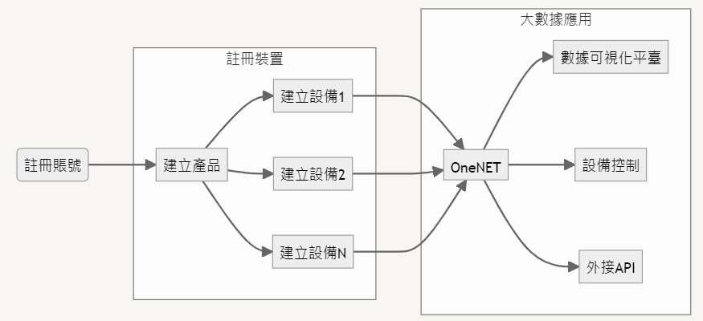

# 移動教育物聯網開發套裝簡介

## 什麼是OneNET?

OneNET是一個數據收集平臺，讓用戶可以自行上載產品數據進行長時間存取。透過提供協定適配、大量連線、資料儲存、裝置管理、規則引擎、事件警報等物聯網應用開發功能，縮短開發週期，減少開發成本，並且將本地的系統連上雲端進行物聯網應用。

## 開發流程

1. 註冊OneNET帳號 
2. 註冊產品及設備
3. 本地設備上傳數據至到OneNET
4. 使用OneNET平臺進行數據可視化/設備控制/或對外分享API

