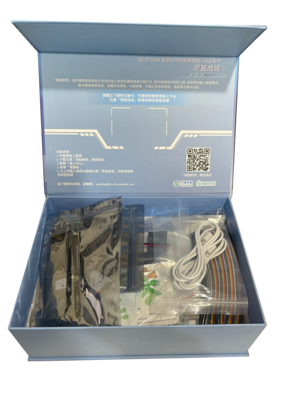
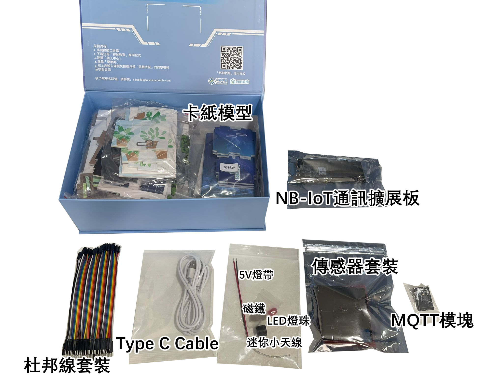
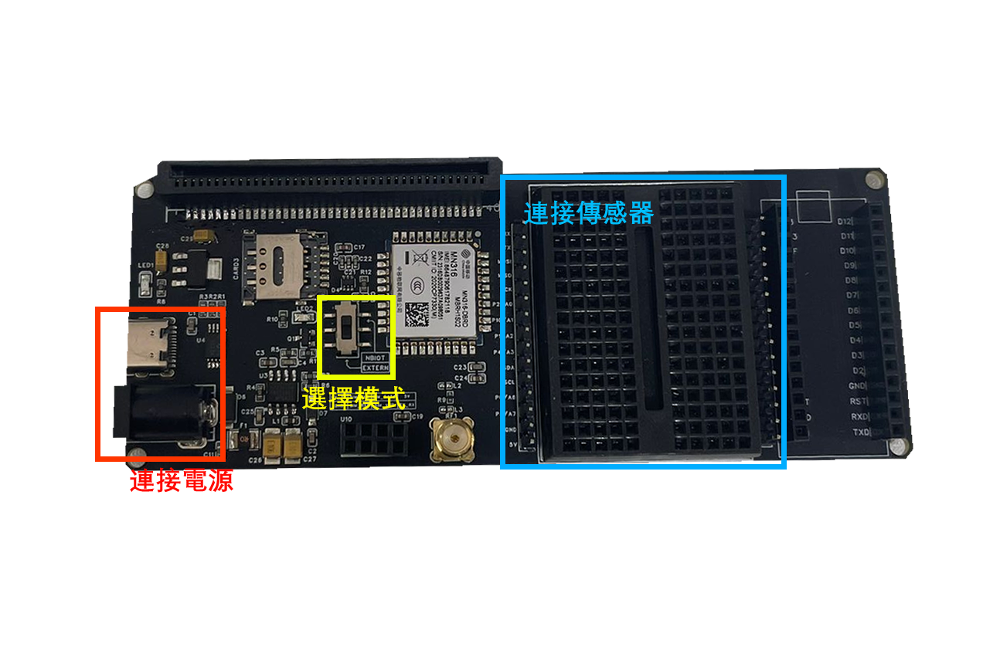
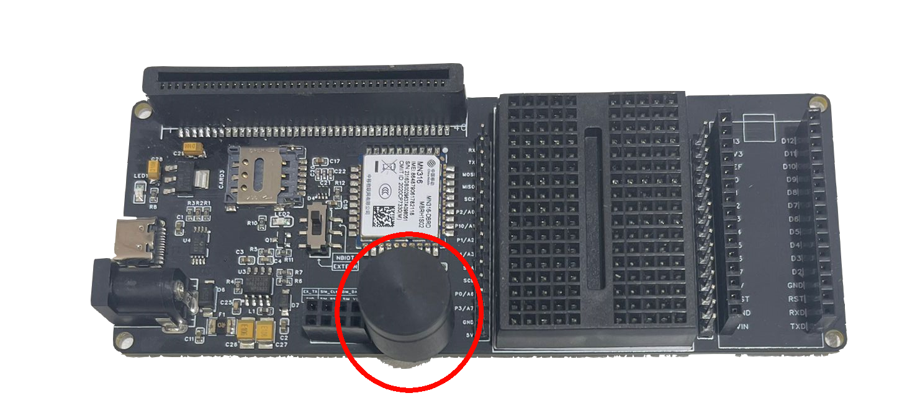

# CMHK Kit Set套件介紹

### 物料表

<table>
  <tr>
    <th>No.</th>
    <th>型號</th>
    <th>數目</th>
  </tr>
  <tr>
    <td>1</td>
    <td>NB-IoT通訊擴展板</td>
    <td>1</td>
  </tr>
  <tr>
    <td>2</td>
    <td>MQTT模組</td>
    <td>1</td>
  </tr>
  <tr>
    <td>3</td>
    <td>傳感器套裝（霍爾效應傳感器，無線充電模塊，無線充電接收模塊，氣體傳感器，光敏傳感器，LED模組x2，聲音傳感器）</td>
    <td>1</td>
  </tr>
  <tr>
    <td>4</td>
    <td>卡紙模型（停車場1，停車場2，無線充電1，無線充電2，傳感器）</td>
    <td>1</td>
  </tr>
  <tr>
    <td>5</td>
    <td>Type C USB Cable</td>
    <td>2</td>
  </tr>
  <tr>
    <td>6</td>
    <td>杜邦綫套裝</td>
    <td>3</td>
  </tr>
  <tr>
    <td>7</td>
    <td>磁鐵</td>
    <td>1</td>
  </tr>
  <tr>
    <td>8</td>
    <td>10mm LED燈珠</td>
    <td>1</td>
  </tr>
  <tr>
    <td>9</td>
    <td>5V燈帶帶線</td>
    <td>1</td>
  </tr>
  <tr>
    <td>10</td>
    <td>迷你小天線</td>
    <td>1</td>
  </tr>
</table>

### NB-IoT通訊擴展板

> 可以通過Type C接口連接5V電源，或通過DC接口連接12V電源。超過12V的電源應降壓后再連接。
> 

> 開關撥至上為NBIOT模式，撥至下為MQTT模式。
> 

> 通過麵包板與麵包板兩側的排針可連接傳感器與microbit。支援5V傳感器，不支援馬達等高功率設備。
> 

### 迷你小天線
