# OneNet & MQTT

Status: Not started

在本教程中，您將學習如何在 OneNet 中建立新的 MQTT 設備

## 開啟並登入OneNet

1. 打開 [https://onenet.hk.chinamobile.com](https://onenet.hk.chinamobile.com/)
2. 右上角注冊賬戶

## 註冊帳號

依指示注冊賬號
*手機號/郵箱選項，請使用手機號注冊

> 注意只有手機號 5/6/9 字頭的號碼才能註冊
如使用郵箱進行注冊功能將受限制
> 

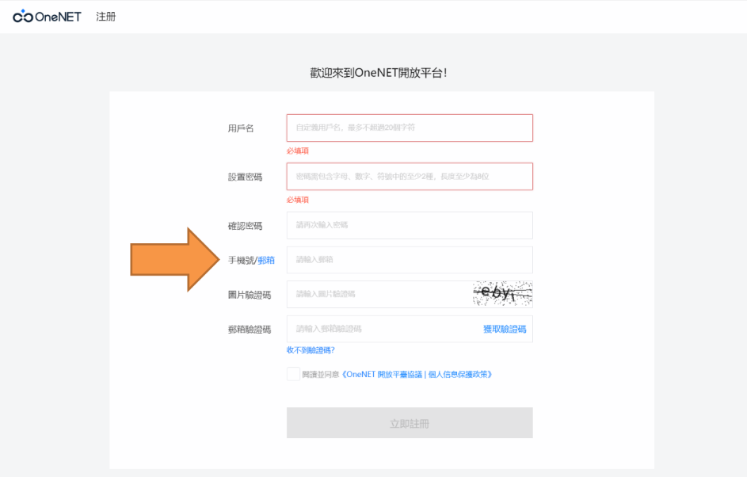

## 登入 OneNet

注冊成功後，點擊開發者中心

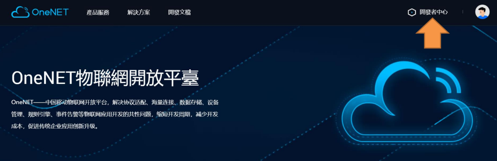

## 建立新產品

1. 點擊多協議接入下的進入

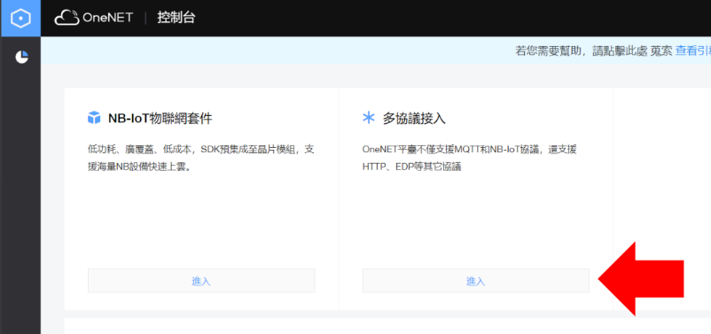

1. 點擊添加產品

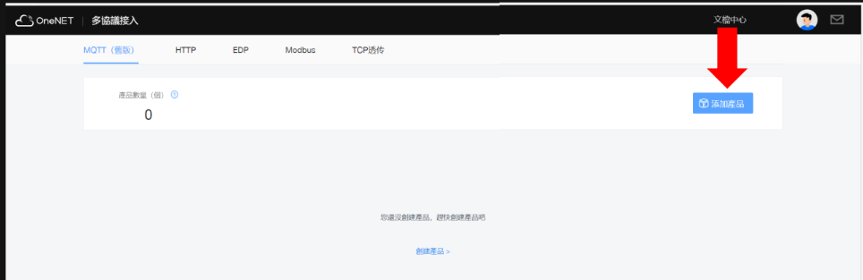

1. 填寫完信息後點擊確定
    1. 產品名稱例子：dht 11　（可以自行修改）

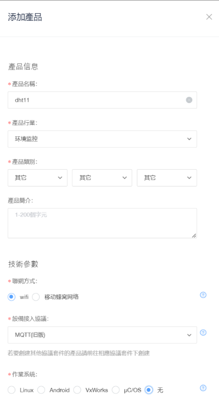

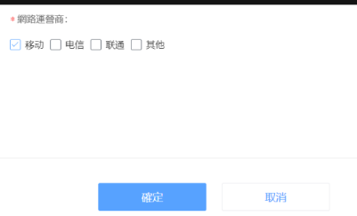

# 檢查設備

1. 　點擊　立即添加設備

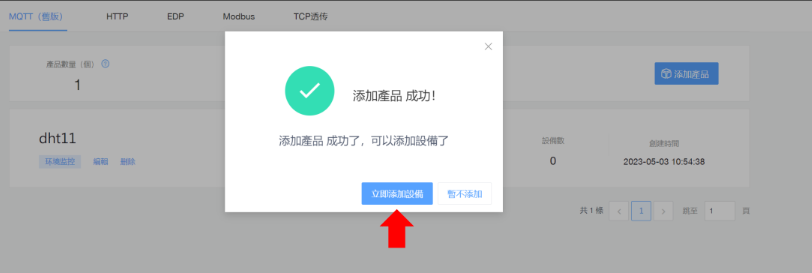

1. 　點擊“添加設備”

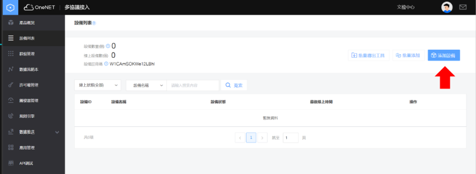

1. 填寫完成後點擊“添加”

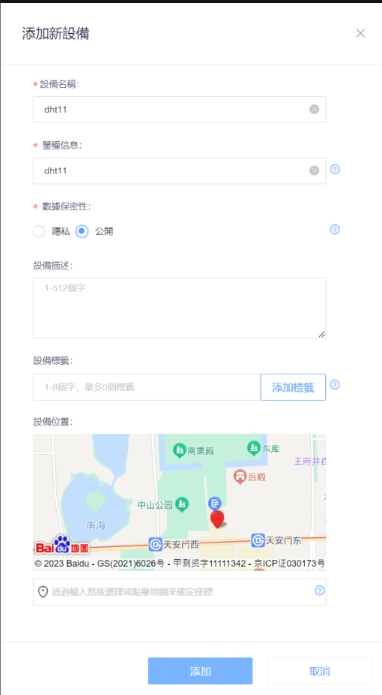

1. 添加設備后可以在設備列表看到剛添加的設備，點擊“詳情＂

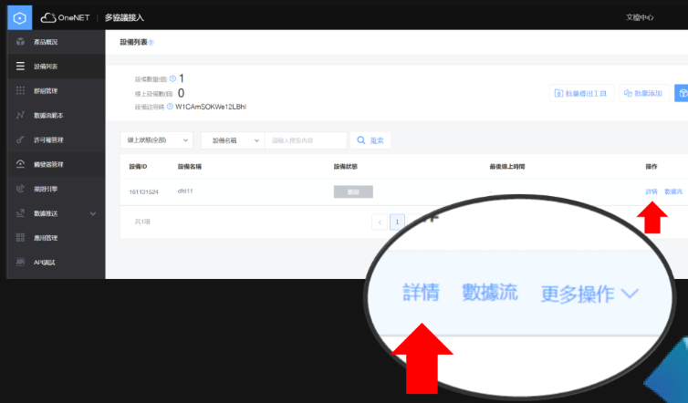

## 設備重要參數

產品ID（Product ID）[PID]： 每一個產品的獨特ID

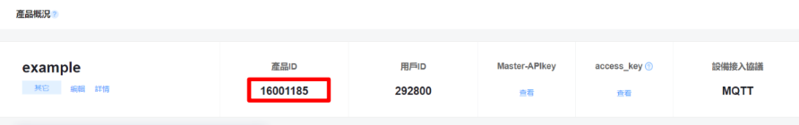

設備IdT(Device ID)[DID]：由系統自己生成的獨特ID
鑒權信息 (Device Password)[DPW]：等於密碼,需要獨一無二而不可與其他設備相撞

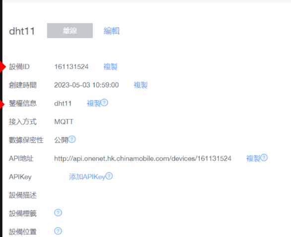

使用時只需要將三項參數( 產品ID, 設備ID,鑒權信息 ) 放入MQTT模組 / 編程便可以使用MQTT功能

## 檢查產品狀態

如果設備已經連上線

返回Onenet 設備列表 可以看到設備 在線

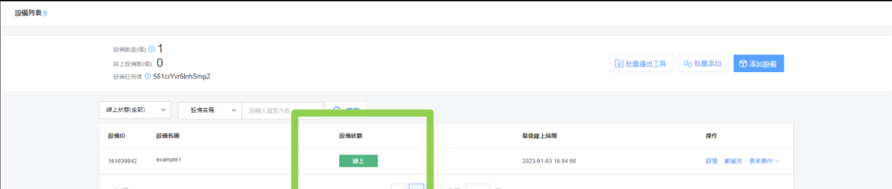

點擊右方操作中的“數據流”就可以看見上傳的數據

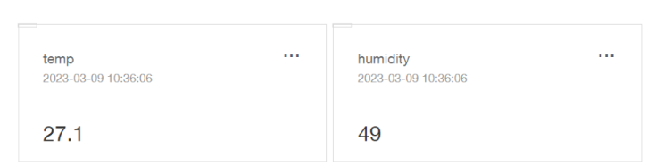

點擊其中一個數據流，可以看到這個數據流中所有上傳的數據

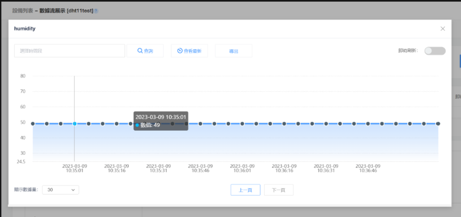