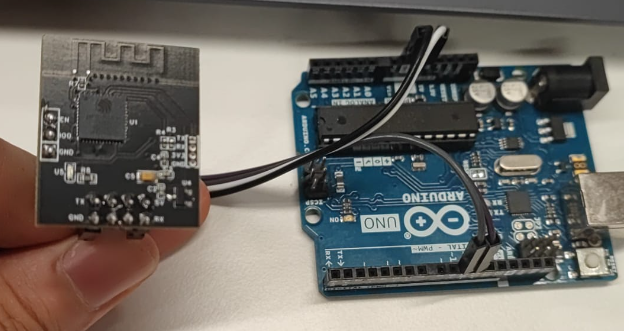
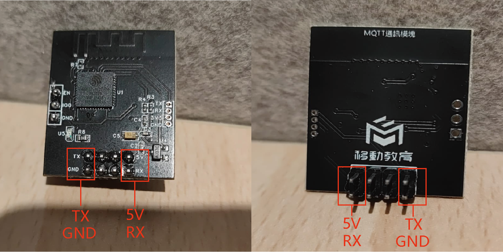

# MQTT 快速上手

### Arduino 使用外部MQTT模組

若要將外部 MQTT 模組與 Arduino Serial 一起使用，請依照下列步驟操作。

## 硬件連接

此模組只需要連接 4 個引腳，分別是 `RX` `TX` `GND` 和 `5V`。



### 與 Arduino UNO 的連接範例



!> 可以連接到預設Serial，例如Serial 0（Ardunio 引腳 0 和引腳 1），但是如果其他程式也需要串口通信，例如 USB調試或外部藍牙模組， 其通訊時會互相干擾。


### 使用 Arduino 板

若要與其他串口連接可以使用SoftwareSerial.h 使用其他接腳進行通訊。

```arduino
#include <SoftwareSerial.h>

#define rxPin 10
#define txPin 11

// 定義MQTT串口
SoftwareSerial mqttSerial(rxPin, txPin);

void setup() {
  // 這是您透過 USB 的串口監視器端口
  Serial.begin(9600);
  // MQTT 的串口端口
  mqttSerial.begin(9600);
}

void loop() {

  if (mqttSerial.available() > 0) {
    //如果收到任何從MQTT接收回來的信息,張列印在USB串口上
    Serial.println(mqttSerial.readString());
  }

  delay(500);
  // 在這裡更改您的 WiFI SSID，替換 My_Wifi
  mqttSerial.println("AT+SSID=My_Wifi"); 
  delay(500);

}
```
### 使用 ESP 板
    
  ESP環境自備Serial0（預設）、Serial1和Serial2，因此使用Serial1和Serial2進行通訊就可以了，不需要任何額外的庫
    
    ```arduino
    
    void setup() {
      // 這是您透過 USB 的串口監視器端口
      Serial.begin(9600);
      // MQTT 的串口端口
      Serial2.begin(9600);
    }
    
    void loop() {
    
      if (Serial2.available() > 0) {
        Serial.println(Serial2.readString());
      }
    
      delay(500);
     // 在這裡更改您的 WiFI SSID，替換 My_Wifi 
      Serial2.println("AT+SSID=My_Wifi"); 
      delay(500);
    
    }
    ```
    

## 第 1 步：儲存 WiFi SSID

使用下列命令將 WiFi SSID 儲存到系統 NVS 中，其中`DATA` 代表 SSID：

```arduino
Serial.println("AT+SSID=DATA");
// Example
Serial.println("AT+SSID=My_WiFi");
```

## 第 2 步: 儲存 WiFi 密碼

使用以下命令將 WiFi 密碼儲存到系統 NVS，其中`DATA` 代表密碼：

```arduino
AT+PW=DATA
// Example 
Serial.println("AT+PW=wifi_password");
```

## 第 3 步：建立 WiFi 連接

使用NVS的SSID和密碼資料開始 WiFi 連接，請使用下列命令。 `Try`代表重試次數（建議至少5次）：

```arduino
AT+CONN=Try
//Example 
Serial.println("AT+CONN=5");
```

> 如果 WiFi 連線成功，紅色 LED 將持續閃爍。 每當斷開連接時，LED 就會熄滅。
> 

> 如果此命令已執行過一次，則裝置將繼續嘗試連線到特定的 WiFi，在斷開連線時也會嘗試自動重新連線。
> 

?> 如果所有程式碼都運作正常，但連線無法運作。 請重新檢查:
- WiFi 是否能連接其他裝置?
- SSID和密碼是否正確?


## 第 4 步：儲存 MQTT 產品 ID

?> 如果你沒有 MQTT 相關的產品參數資訊, 可以在這裏參考如何新增 MQTT 產品 **[建立產品](mqtt&onenet/)**

使用下列命令將 MQTT 產品 ID 儲存至系統 NVS，其中`DATA` 代表產品 ID 值:

```arduino
AT+PID=DATA
//Example 
Serial.println("AT+PID=123456");
```

## 第 5 步： 儲存 MQTT 設備 ID

使用以下命令將設備 ID 儲存到系統 NVS 中，其中 `DATA` 代表設備ID值：

```arduino
AT+DID=DATA
//Example 
Serial.println("AT+DID=123456");
```

## 第 6 步： 儲存 MQTT 設備密碼

使用以下命令將設備密碼儲存到系統 NVS 中，其中 `DATA` 代表設備密碼:

```arduino
AT+DPW=DATA
//Example 
Serial.println("AT+DPW=CMHK1234");
```

### 第 7 步： 建立 MQTT 連接

若要開始與伺服器的 MQTT 連接，請使用下列命令。 `DATA` 無需輸入特定值 .連接 MQTT 後，系統將啟用「oncall」功能。 從伺服器接收的任何訊息都將採用 `>recv: DATA`. 格式。 如果 Arduino 需要來自串列字串的額外數據，請使用 `>revc:` 作為分隔符，然後提取數據。

```arduino
AT+MQTTCONN=DATA
//Example 
Serial.println("AT+MQTTCONN=5");
```

> 如果建立 MQTT 連接，紅色 LED 將會亮起。
> 

!> 不要在沒有 WiFi 連線的情況下嘗試連線 MQTT，這將導致啟動循環以及錯誤

?> 如果 MQTT 連線斷開，您必須要再次執行此程式碼以重新連接 MQTT 伺服器


### 第 8 步： 發送數據點

若要將單一資料點傳送至 MQTT 伺服器，請使用下列命令格式： `AT+SEND=DATA`, 其參數值分別為:

- `X` 是資料流的`topic`名稱.
- `Y` 是資料點的浮點數值.

例如要傳送主題名稱為 "Temp" 且值為 25.4 的資料點，請使用下列命令：

```arduino
AT+SEND=x,y
//Example topic is temp and the data is 25.4
Serial.println("AT+SEND=Temp,25.4);
```

這會將主題名稱為「Temp」且值為 25.4 的資料點傳送到 MQTT 伺服器。

## Arduino UNO 的完整範例

```arduino
#include <SoftwareSerial.h>

#define rxPin 10  
#define txPin 11  

SoftwareSerial mqttSerial(rxPin, txPin);

bool setup_MQTT =true;

void setup() {
  // This is your serial monitor port through USB
  Serial.begin(9600);
  mqttSerial.begin(9600);

  // 把所有設定指令在 setup 中完成
  mqttSerial.println("AT+SSID=WIFI_SSID");  // chaneg WIFI_SSID to your WIFI SSID
  delay(500);
  mqttSerial.println("AT+PW=WIFI_PW");  // change WIFI_PW to your WIFI password
  delay(500);
  mqttSerial.println("AT+PID=123456"); // change 123456 to your product ID
  delay(500);
  mqttSerial.println("AT+DID=123456"); // change 123456 to your Device ID
  delay(500);
  mqttSerial.println("AT+DPW=devicePW"); // change devicePW to your Device Password
  delay(500);
  setup_MQTT=false;  
  delay(2000);
  mqttSerial.println("AT+CONN=5"); // Attempt WIFI conection 
  delay(2000);
  mqttSerial.println("AT+MQTTCONN=5"); // Attempt MQTT conection 
  delay(2000);

}

void loop() {

  if (mqttSerial.available() > 0) {
    Serial.println(mqttSerial.readString());
  }

  mqttSerial.println("AT+CONN?");
  delay(2000);

  mqttSerial.print("AT+SEND=");
	mqttSerial.print("Temp"); //  this is the name of the data topic, e.g. tempeture , hudmity , power 
	mqttSerial.print(",");
  mqttSerial.print(123.7); // change the vaule here for data
  mqttSerial.println();

}
```
